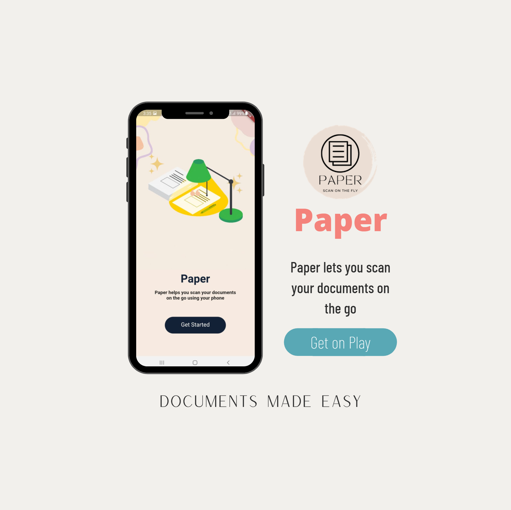
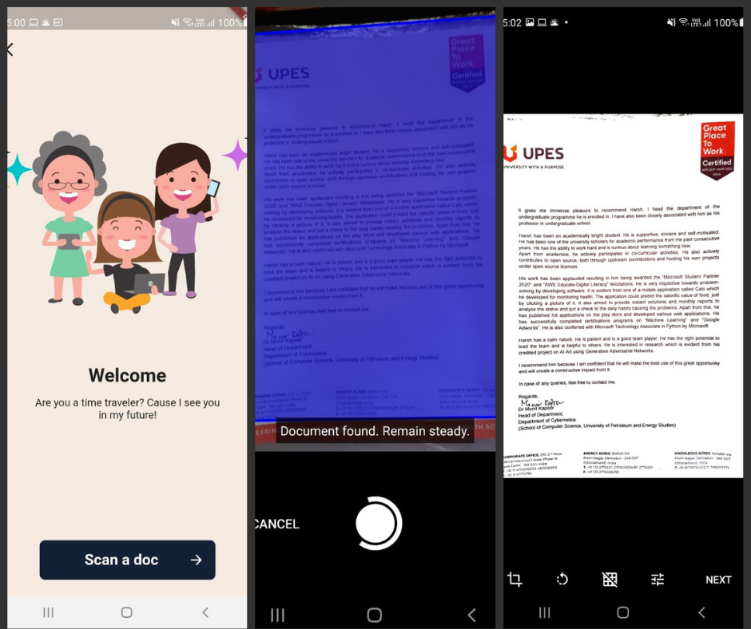

# Paper
Scan documents on the go
Announcing "Paper" for #Mobile.
Snap those docs at ease with real-time doc detection, multi-page pdf, optimized, and cleaned clicks from an easy-to-navigate UX.
# About
Paper is a cross platform application developed using Flutter.
## Getting Started

<object data="/images/PaperLaunch.pdf" type="application/pdf" width="700px" height="700px">
    <embed src="/images/PaperLaunch.pdf">
        
PDF Not supported by this browser.

    </embed>
</object>
